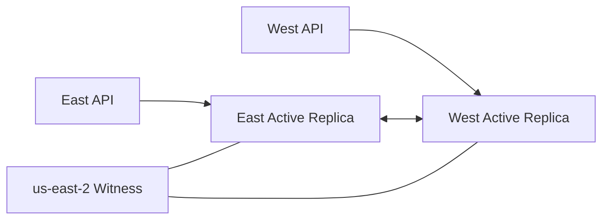

# Data and Region Boundaries

## MR-007

Each Region owns one DynamoDB table, one documents bucket, one queue, one DLQ, one publisher, and one worker. No normal runtime performs cross-region reads or writes.

## Locality rule

The regional API writes only to its module resources. The publisher sends only to the local queue. The worker consumes only the local queue and writes only to local stores.

## Shared boundaries

Cognito is shared. Authentication is global; application data is regional. CloudFront and frontend hosting are shared.

## MR-008 target

## S3 target

Document replication is separate from DynamoDB. Upload locally, persist origin bucket/Region, replicate asynchronously, read locally when present, and define deliberate fallback behavior.

## Conflict model

Replication does not replace deterministic IDs, idempotency keys, request fingerprints, version checks, deterministic outbox IDs, leases, or conditional updates.

## GDPR extensibility

Future jurisdiction groups can compose independent regional sets, such as US (`use1`, `usw2`) and EU (`euc1`, `euw1`), with customer home jurisdiction determining routing and replication boundaries.
