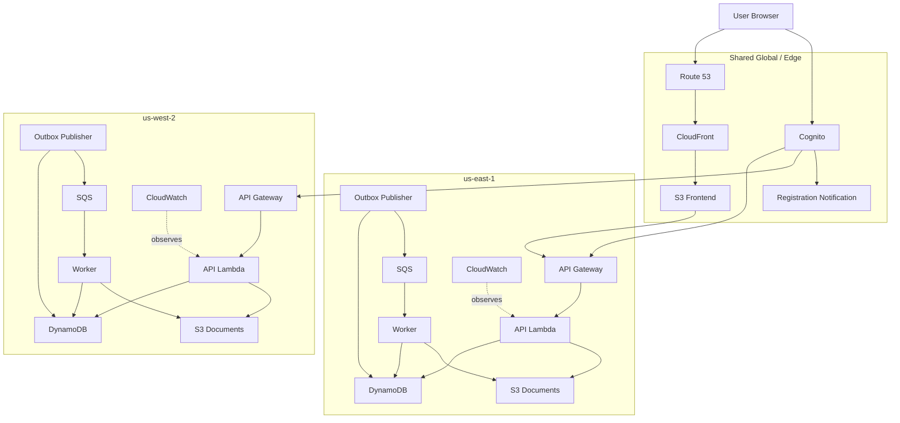

# Platform V2 Architecture

## Executive summary

Platform V2 rebuilds the AI Resume Coach as a symmetric two-site serverless platform. The active application sites are `us-east-1` and `us-west-2`. Each site uses the same Terraform regional module and contains the same runtime capabilities:

- API Gateway HTTP API;
- API Lambda;
- resume-analysis worker Lambda;
- transactional outbox publisher Lambda;
- regional SQS queue and dead-letter queue;
- regional document bucket;
- regional DynamoDB boundary during MR-007;
- regional monitoring and alarms;
- regional IAM permissions.

Shared capabilities remain outside the regional module:

- Cognito identity;
- registration notification;
- frontend S3 hosting;
- CloudFront;
- ACM certificate;
- Route 53 records;
- package construction;
- Terraform orchestration.

MR-007 establishes symmetric regional deployment. It does not yet enable shared multi-region application data or production traffic balancing.

## Design goals

1. Treat both application Regions as peers.
2. Eliminate separate east and west implementations.
3. Make regional behavior explicit in Terraform.
4. Keep runtime resources local to their Region.
5. Preserve idempotency, outbox, replay, and provenance patterns.
6. Support future MRSC, traffic routing, and chaos testing without another infrastructure redesign.
7. Make root Terraform read like architecture composition.
8. Allow one Region to be tested or removed independently.
9. Keep global user-facing resources separate from regional runtimes.

## Non-goals for MR-007

- DynamoDB multi-region replication;
- S3 cross-region replication;
- Route 53 API latency routing;
- automatic regional failover;
- formal RTO/RPO commitments;
- cross-region queue consumption;
- production traffic to both APIs.

## Logical architecture



## Architectural layers

### Shared identity

One Cognito user pool serves both regional APIs. Both JWT authorizers trust the same issuer and audience. Registration notification remains shared because it belongs to the shared user pool.

### Global edge

One frontend, CloudFront distribution, certificate, and custom domain remain global. During MR-007, generated frontend configuration points only to the east API. West is tested directly.

### Regional application

The regional module is the primary building block. Each instance owns the complete execution path:

```text
API request → API Lambda → DynamoDB transaction → outbox → publisher → regional SQS → regional worker → persistence
```

Normal operation never requires cross-region runtime access.

### Regional data

MR-007 uses independent DynamoDB tables and document buckets. MR-008 replaces the temporary table topology with the selected MRSC design.

### Operations

Each Region has dashboards, alarms, regional log groups, queue monitoring, and an operational-alert topic.

## Runtime identity

Every runtime continues to expose and persist environment, Region, deployment ID, and application version. Persistent records retain creation, update, and processing provenance.

## Target evolution

- **MR-007:** symmetric sites with independent data.
- **MR-008:** MRSC with active replicas in `us-east-1` and `us-west-2`, witness in `us-east-2`.
- **MR-009:** replicated document behavior and regional messaging validation.
- **MR-010:** traffic management and health-based routing.
- **MR-011:** chaos testing, RTO/RPO measurement, recovery, and failback.

## Success definition

Platform V2 succeeds when an engineer can inspect root Terraform and immediately identify two peer sites, deploy both from one module, verify local resource use, remove one without damaging the other, and evolve the data layer without restructuring compute and messaging.
