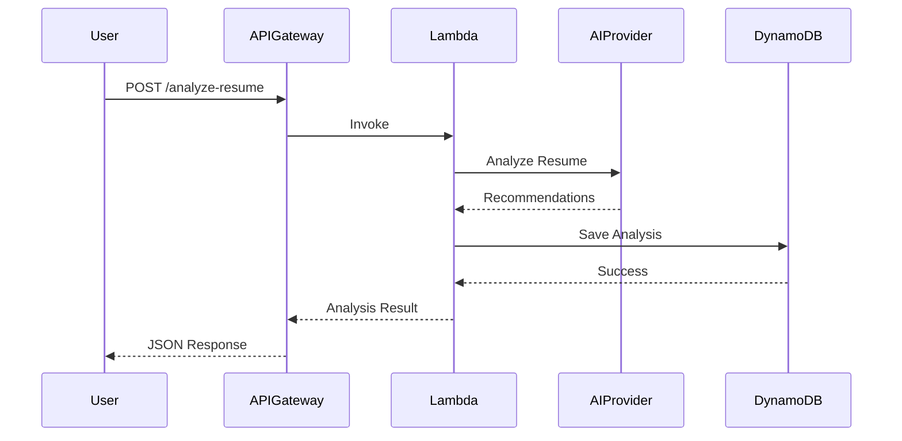

# Resume Analysis Request Flow

```mermaid
sequenceDiagram

participant User
participant APIGateway
participant Lambda
participant AIProvider
participant DynamoDB

User->>APIGateway: POST /analyze-resume

APIGateway->>Lambda: Invoke

Lambda->>AIProvider: Analyze Resume

AIProvider-->>Lambda: Recommendations

Lambda->>DynamoDB: Save Analysis

DynamoDB-->>Lambda: Success

Lambda-->>APIGateway: Analysis Result

APIGateway-->>User: JSON Response
```

